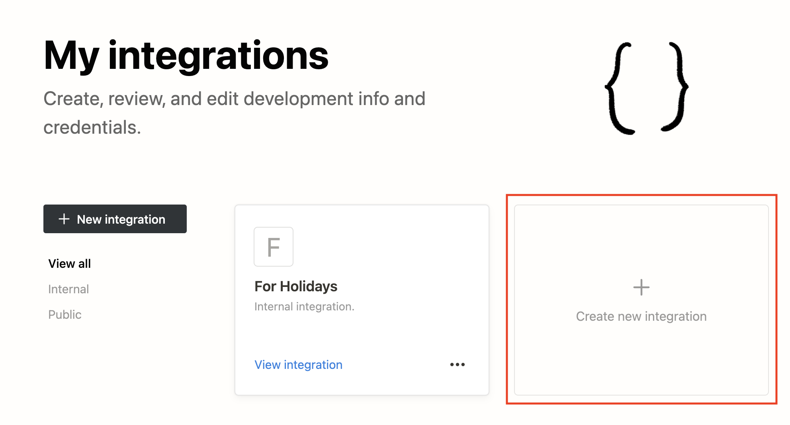
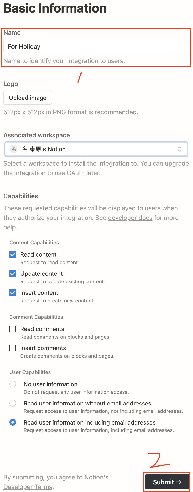
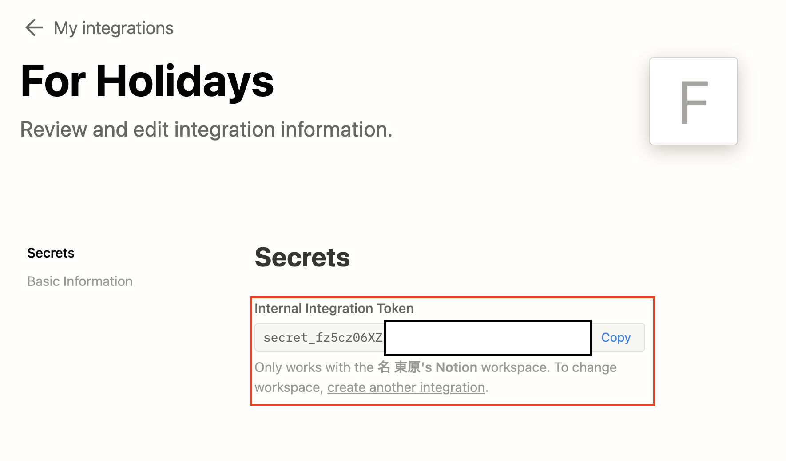
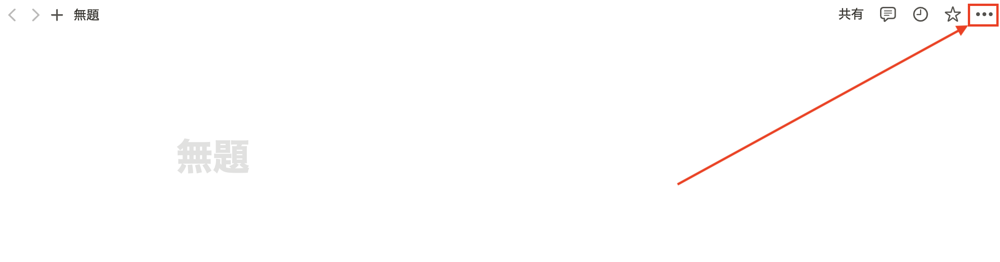

## 祝日をNotionのカレンダー追加しょう！
<br/>
このレポジトリーは、祝日をnotionのカレンダーデータベースに簡単に追加してくれるコードのものになります。
<br/>
<br/><br/>
#### 実行にあたって必要なもの
- NotionのAPIキーの発行
- Python 3.8 ↑　
- notion_client ライブラリ

<br/><br/>

# 手順
## Syukujitsu.netから祝日のデータをダウンロード

<br/>
ダウンロードしたファイルをcsvフォルダの中に入れておきます。
<br/><br/><br/>

## NotionAPIキーの発行
https://www.notion.so/my-integrations に接続します。


<br/>
Create New Integrationをクリックします。
<br/>

<br/><br/><br/><br/>
 Nameに 'For Holiday'を入力し、<br/>オプションとしてworkspaceを選択してあげます。
<br/><br/><br/><br/>


<br/>

#### copyボタンを押して、`API_KEY`を他の誰かが見れない<br/>安全なところに貼り付けて保存しておきましょう。
<br/><br/>


##　データベースのリンクの取得


<br/>
#### 後で`データベースのリンク`も使われますので、どこかに貼り付けておきましょう。
<br/><br/>


## NotionAPIに権限を付与
##### 作ったNotionAPIにデータベースの修正の権限を付与します。


<br/>
「はい」を押して、次のステップへ移行します。
<br/><br/>


## Notionの設定
##### 対象になるカレンダーのデータベースのレイアウトを変えていきます。
<br/>


<br/>
カレンダービューの右の方にある...をクリックします。
<br/>


<br/>
テーブルを押します。
<br/>


<br/>
「名前」、「タグ」、「日付」
それぞれの列が存在するか、そして日本語で書いているかを確認します。
存在しない場合、新しく作っておきましょう。

<br/><br/>

## notion_clientのライブラリーのインストール

ターミナルまたはcmdを開き、`pip install notion-client`を入力します。
<br/><br/>
## 実行！

```sh
python [fetchNotionまでのパス]/fetchNotion.py
```
を実行し、先に保存しておいたAPI KEYとデータベースのリンクを貼り付けてあげます。


上のように追加していくと終わりです！
お疲れ様でした！