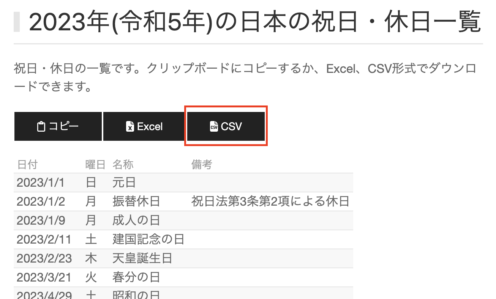
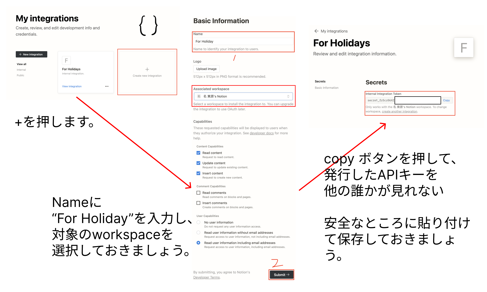
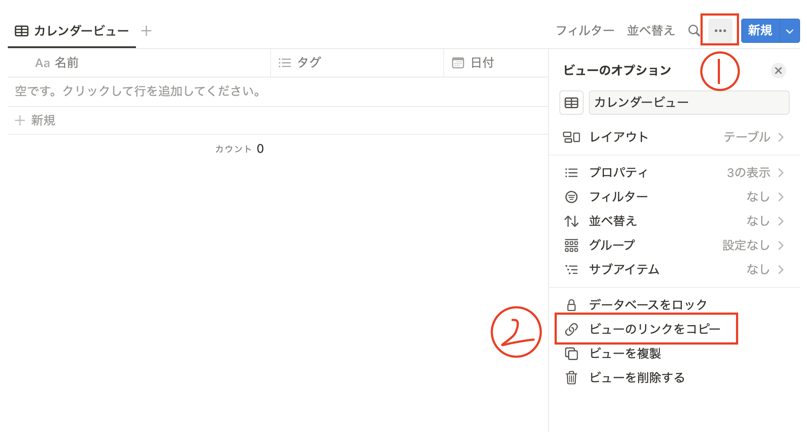
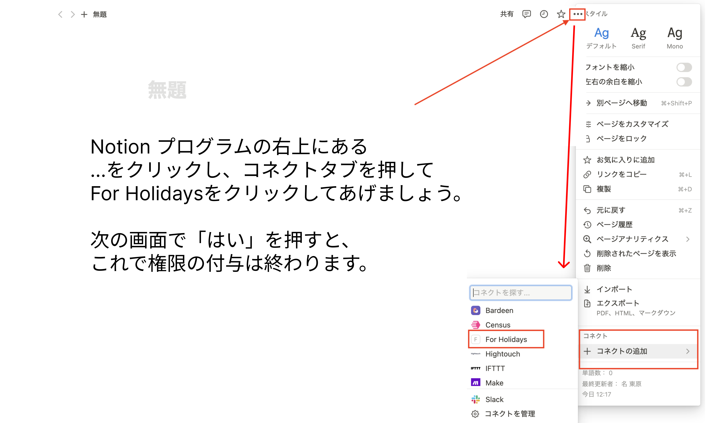
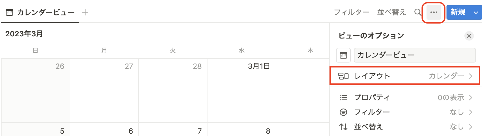
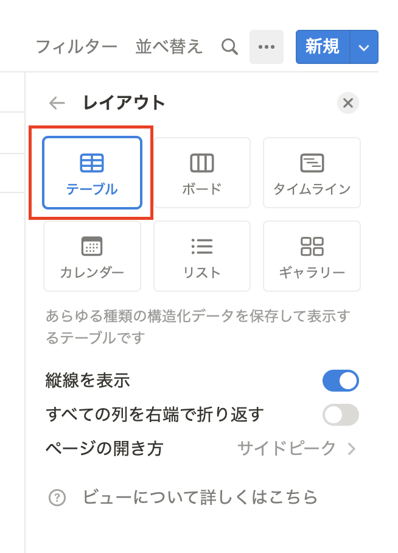
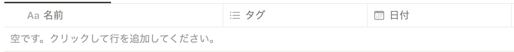
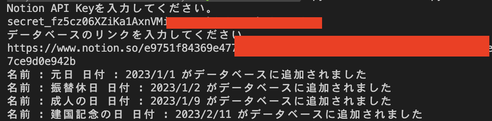

## 祝日を Notion のカレンダー追加しょう！

<br/>
このレポジトリーは、祝日をnotionのカレンダーデータベースに簡単に追加してくれるコードのものになります。
<br/>
<br/><br/>

ダウンロード :         [](https://github.com/DongwonTTuna/HolidayToNotion/releases/download/publish/Holiday2Notion.zip)
<br/><br/><br/>

#### 実行にあたって必要なもの

- NotionのAPIキーの発行
- Python 3.8 ↑　
- notion_client ライブラリのインストール

<br/><br/>

# 手順

<br/>
いくつかの設定をしてあげる必要がありますが、<br/>
写真と共に詳細に説明しておきましたので頑張っていきましょう！
<br/><br/>

## Syukujitsu.net から祝日のデータをダウンロード
<br/>

#### https://shukujitsu.net/ に接続します。
<br/>


<br/><br/><br/>
ダウンロードしたファイルを `csv フォルダ`の中に入れておきます。
<br/><br/><br/>

## NotionAPI キーの発行

https://www.notion.so/my-integrations に接続します。



<br/><br/><br/>

## データベースのリンクの取得

<br/>
写真に従ってデータベースのリンクをコピーしましょう。



<br/><br/><br/>

#### 後で`データベースのリンク`も使われますので、どこかに貼り付けておきましょう。

<br/><br/><br/>

## NotionAPI に権限を付与

##### 作った NotionAPI にデータベースの修正の権限を付与します。

<br/>
<br/>
<br/>


<br/><br/><br/>

## Notion の設定

<br/>

##### 対象になるカレンダーのデータベースのレイアウトを変えていきます。

<br/>


<br/><br/><br/>
カレンダービューの右の方にある...をクリックしてレイアウトを押します。
<br/><br/><br/>


<br/><br/><br/>
テーブルを押します。
<br/><br/><br/>


<br/><br/><br/>
「名前」、「タグ」、「日付」
それぞれの列が存在するか、そして日本語で書いているかを確認します。<br/>存在しない場合は新しく作っておきましょう。
<br/><br/><br/>

## notion_client のライブラリーのインストール

ターミナルまたは cmd を開き、`pip install notion-client`を入力します。
<br/><br/><br/>

## 実行！

```sh
python [Holiday2Notionまでのパス]/Holiday2Notion.py
```

を実行し、先に保存しておいた API KEY とデータベースのリンクを貼り付けてあげます。



上のように追加していくと終わりです！
お疲れ様でした！
